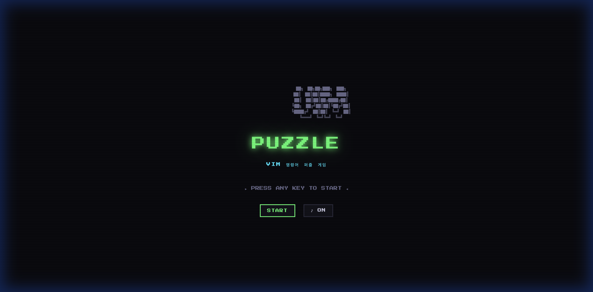
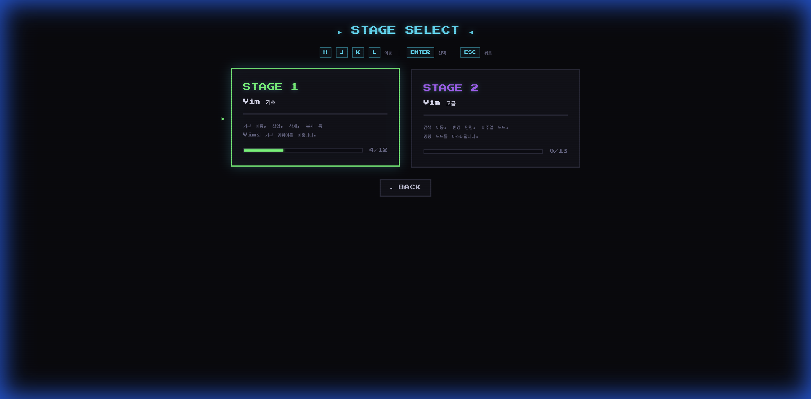
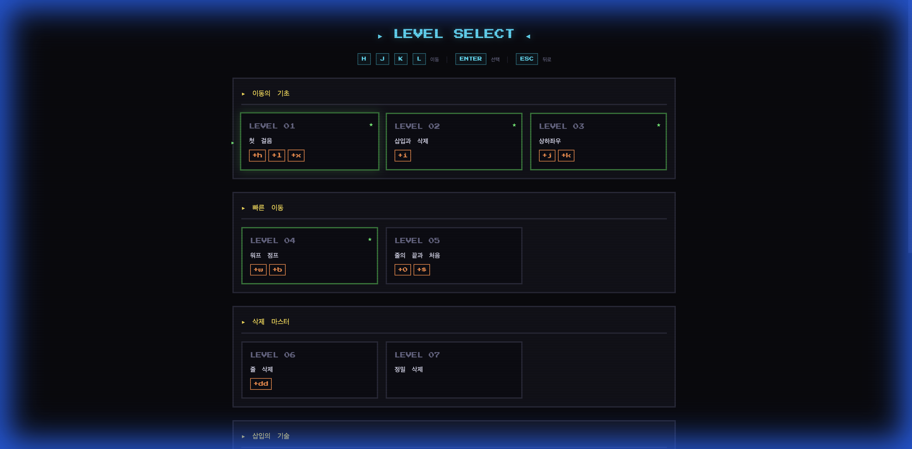
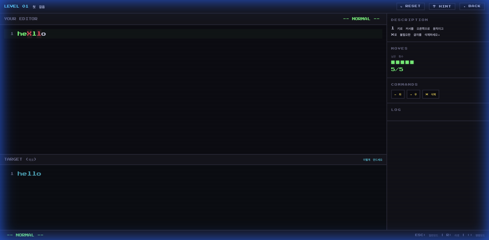
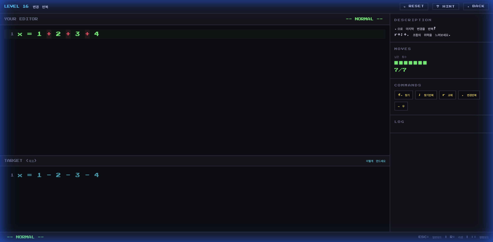
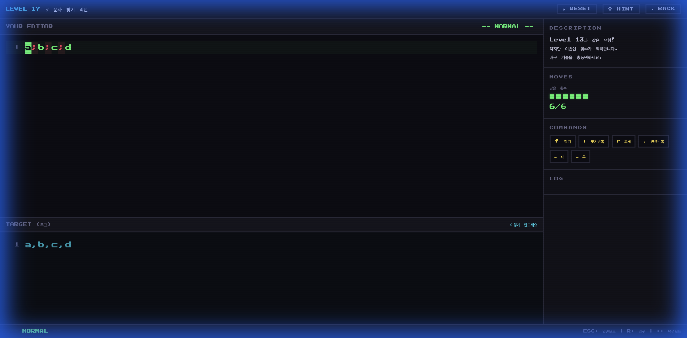

<div align="center">

# 🎮 VIM PUZZLE - 빔 퍼즐

**퍼즐을 풀면서 배우는 Vim 에디터**

Vim의 명령어를 퍼즐 형식으로 학습하는 웹 기반 게임입니다.
제한된 명령어와 횟수 안에서 텍스트를 목표대로 수정하세요!



</div>

---

## 📖 게임 소개

VIM PUZZLE은 Vim 에디터의 명령어를 **퍼즐을 풀 듯이** 재미있게 배울 수 있는 게임입니다.

- 🎯 **목표**: `YOUR EDITOR`의 텍스트를 `TARGET`과 동일하게 만드세요
- ⚡ **제한**: 허용된 명령어와 최대 횟수 안에서 풀어야 합니다
- 📈 **점진적 학습**: 기초부터 고급까지, 레벨을 진행하며 자연스럽게 최적의 Vim 사용법을 발견합니다

---

## 🖼️ 게임 화면

### 🏠 스테이지 선택
`h/j/k/l` 키로 Vim 스타일 네비게이션!



### 📋 레벨 선택
챕터별로 정리된 레벨, 각 레벨마다 새로운 명령어를 학습합니다.



### 🎮 게임 플레이 (기초)
에디터에서 텍스트를 수정하여 목표와 동일하게 만드세요.



### ⚡ 고급 명령어
`f`(찾기) + `r`(교체) + `;`(찾기반복) + `.`(변경반복) 조합으로 효율적으로 편집!



### 🔥 콜백 레벨 - 최적 해법 발견
이전에 풀었던 문제가 더 빡빡한 제한으로 재등장!
기본 방법으론 불가능 → **최적 해법만 통과** 👀



---

## 🎓 학습 커리큘럼

### Stage 1: Vim 기초 (12 레벨)

| 챕터 | 학습 내용 | 주요 명령어 |
|------|----------|------------|
| 이동의 기초 | 커서 이동과 기본 편집 | `h` `j` `k` `l` `x` `i` |
| 빠른 이동 | 단어/줄 단위 이동 | `w` `b` `0` `$` |
| 삭제 마스터 | 줄 삭제와 조합 | `dd` |
| 삽입의 기술 | 다양한 삽입 방법 | `A` `o` |
| 복사 & 붙여넣기 | 줄 복사와 재배치 | `yy` `p` `gg` `G` |
| 종합 도전 | 모든 기초 기술 활용 | 전체 |

### Stage 2: Vim 고급 (13 레벨)

| 챕터 | 학습 내용 | 주요 명령어 |
|------|----------|------------|
| 검색과 교체 | 문자 찾기와 교체 | `f` `r` `;` `.` |
| ⚡ 효율의 발견 | 콜백 레벨 + 단어 교체 | `cw` + `.` 조합 |
| 구조 편집 | 괄호/따옴표 내부 편집 | `ci(` `di(` `ci"` |
| 비주얼 모드 | 범위 선택 후 편집 | `v` `V` |
| 명령 모드 | 검색/치환 | `:s` |
| ⚡ 종합 도전 | 최적 해법 필수 | 전체 |

---

## 🕹️ 조작법

| 키 | 동작 |
|----|------|
| `h/j/k/l` | 메뉴 네비게이션 / 게임 내 커서 이동 |
| `Enter` | 선택 |
| `Esc` | 뒤로가기 / NORMAL 모드 전환 |
| `u` | RESET |
| `?` | HINT |

> 💡 **한글 입력(IME) 상태에서도 정상 동작합니다!**

---

## 🚀 실행 방법

```bash
# 저장소 클론
git clone https://github.com/KIMMUSIC/vimGame.git
cd vimGame

# 로컬 서버 실행
python3 -m http.server 8080

# 브라우저에서 접속
# http://localhost:8080
```

외부 라이브러리 없이 **순수 HTML/CSS/JavaScript**로 구현되어 있어
별도의 설치 없이 바로 실행 가능합니다.

---

## 📁 프로젝트 구조

```
vim-game/
├── index.html          # 메인 HTML
├── css/
│   ├── main.css        # 스타일시트
│   └── animations.css  # 애니메이션
├── js/
│   ├── main.js         # 앱 진입점 & 화면 전환
│   ├── engine.js       # Vim 에뮬레이션 엔진
│   ├── puzzle.js       # 퍼즐 로직
│   ├── levels.js       # 레벨 데이터 (25개)
│   ├── renderer.js     # UI 렌더링
│   └── audio.js        # 8bit 사운드
└── screenshots/        # README 이미지
```

---

## 🎨 특징

- **🕹️ 픽셀 아트 UI** — 레트로 감성의 게임 인터페이스
- **🔊 8bit 사운드** — 키 입력과 클리어 시 사운드 효과
- **📈 점진적 난이도** — 쉬운 문제 → 어려운 문제 순서대로
- **⚡ 콜백 레벨** — 같은 유형 문제를 최적 방법으로 재도전
- **🇰🇷 한글 IME 지원** — 한글 입력 상태에서도 완벽 동작
- **💻 의존성 없음** — 순수 HTML/CSS/JS, 설치 불필요

---

## 📄 License

MIT License
